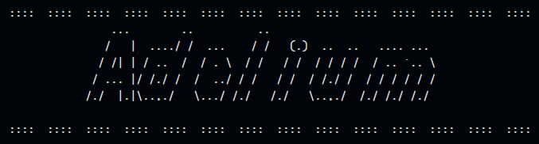

# Projet Adelium:

## Présentation:

Le projet de la Plateforme de Formation est une initiative passionnante de l'entreprise ADELIUM visant à rendre l'apprentissage de l'informatique accessible et efficace pour tous.

### A propos de l'entreprise: 
Adelium est une entreprise spécialisée dans la formation en informatique et les services technologiques. Fondée en [//TODO], notre entreprise se consacre à l'offre de formations de qualité et de solutions informatiques de pointe.

### Notre Objectif
Notre objectif avec ce projet est de créer une plateforme conviviale qui offre :

Des ressources gratuites pour enrichir vos connaissances en informatique.
Des tutoriels interactifs pour apprendre de manière pratique.
Des exercices et des quiz pour tester vos compétences.
Un accès à des formations de qualité, que vous soyez un débutant ou un professionnel chevronné.

## Structure du Monorepo

Ce monorepo est organisé en trois dossiers principaux :

### `backend` : 
L'application Spring Microservice.

#### Architecture

  * **common**:
  * services:
    - **auth-service**
    - **discovery-server**
    - **config-service**
    - **gateway**
    - **quiz**
- `frontend` : L'application Angular.
- `doc` : La documentation du projet.

## Technologies Utilisées

- **Backend** :
  - Langage : Java
  - Framework : Spring Framework
  - Base de Données : MySQL

- **Frontend** :
  - Framework : Angular.

## Fonctionnalités Principales

Le projet comprend les fonctionnalités suivantes :

- **Pages Publiques** : Accueil, À Propos, Conditions d'Utilisation, etc.
- **Formations** : Création, publication, gestion des cours avec sections, articles, vidéos, ressources, ateliers et évaluations.
- **Quiz** : Gestion de quiz et d'évaluations avec analyse des résultats.
- **Gestion des Rôles et des Autorisations** : Contrôle des accès et des actions pour chaque rôle.
- **Espaces de Travail et de Communication** : Groupes de travail et classes avec des fonctionnalités de collaboration.
- **Interface d'Administration** : Gestion sécurisée des utilisateurs, des cours, des ressources et des autorisations.

## Installation

Veuillez consulter les instructions détaillées dans les notre [Documentation](docs/index.md) pour l'installation et la configuration de chaque partie de l'application.

## Contributeurs

// TODO

## Licence

Ce projet est sous licence privée [LICENCE](./LICENCE).